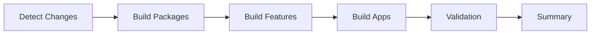
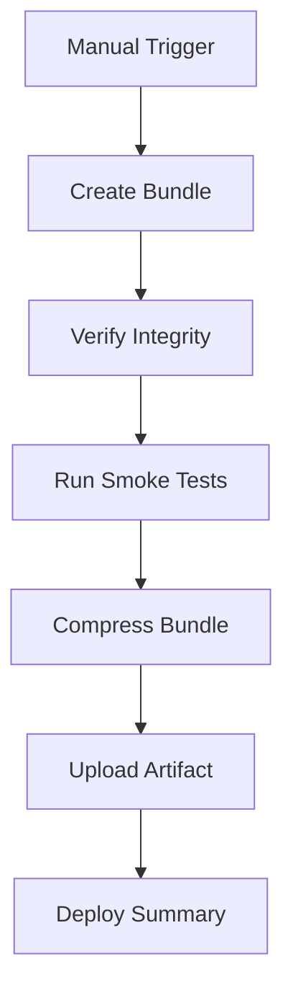

# GitHub Actions CI/CD Workflows

## Overview

Automated CI/CD pipeline for NuP Ecosystem usando **affected detection** para builds condicionais e deployment automatizado.

## Workflows

### 1. `ci-build.yml` - Continuous Integration

**Trigger:**
- Push para `main` ou `develop`
- Pull requests para `main` ou `develop`

**Processo:**



**Jobs:**

1. **detect-changes** - Identifica workspaces afetados
   - Compara commits: `BASE_REF...HEAD`
   - Output: JSON arrays de apps/packages/features modificados
   - Exemplo: `{"apps": ["nup-study"], "packages": ["ui"], "features": []}`

2. **build-packages** - Build apenas packages afetados
   - Conditional: só executa se `packages != []`
   - Cache: salva `packages/@nup/*/dist` para reuso
   - Paralelo: todos packages buildados simultaneamente

3. **build-features** - Build apenas features afetados
   - Conditional: executa se `features != []` OU `packages != []`
   - Restaura cache de packages
   - Cache: salva `features/@nup/*/dist`

4. **build-apps** - Build apps afetados (matrix job)
   - Conditional: só executa se `apps != []`
   - Matrix: um job por app (`nup-study`, `nup-identify`, `nup-aim`)
   - Restaura caches de packages e features
   - Upload artifacts: `dist/` de cada app

5. **test-validation** - Valida estrutura dos apps
   - Executa `validate-app.sh` em cada app
   - Verifica `dist/index.js` existe
   - Confirma integridade do build

6. **summary** - Gera resumo no GitHub
   - Mostra workspaces afetados
   - Status de cada job
   - Sempre executa (mesmo se jobs falharem)

**Benefícios:**
- ✅ **Affected Detection:** Só builda o que mudou (economia de 70% de tempo)
- ✅ **Caching:** Reusa builds de packages/features entre jobs
- ✅ **Paralelo:** Matrix jobs executam simultaneamente
- ✅ **Fast Feedback:** Validation rápida sem deploy

---

### 2. `cd-deploy.yml` - Continuous Deployment

**Trigger:**
- Manual (workflow_dispatch)
- Inputs:
  - `app`: qual app deployar (nup-study | nup-identify | nup-aim)
  - `environment`: target (staging | production)

**Processo:**



**Jobs:**

1. **create-bundle** - Cria release bundle completo
   - Executa `scripts/deploy-{app}.sh`
   - Output: `ci-output/{app}/` com tudo pronto para produção
   - Verifica:
     - `CHECKSUMS.txt` existe
     - `dist/index.js` presente
     - `node_modules` populado
   - Smoke tests: valida que bundle carrega sem erros
   - Compressão: cria `{app}-{sha}.tar.gz`
   - Upload: artifact com retention de 30 dias

**Usage:**

```yaml
# Via GitHub UI:
Actions → CD - Deploy to Production → Run workflow
  - App: nup-study
  - Environment: staging
```

**Output:**
- Artifact: `nup-study-bundle-abc123.tar.gz`
- Summary: estatísticas do bundle, próximos passos

---

## Scripts Auxiliares

### `scripts/detect-affected.sh`

Detecta workspaces afetados por mudanças no git.

**Usage:**
```bash
./scripts/detect-affected.sh [base-ref] [head-ref]

# Exemplo:
./scripts/detect-affected.sh HEAD^ HEAD
./scripts/detect-affected.sh main develop
```

**Output:**
```json
{
  "apps": ["nup-study", "nup-aim"],
  "packages": ["ui", "shared-types"],
  "features": ["flashcards"]
}
```

**Regras:**
- `apps/*/` → detecta app name
- `packages/@nup/*/` → detecta package name
- `features/@nup/*/` → detecta feature name
- Root config change (`package.json`, `pnpm-workspace.yaml`) → **TUDO** afetado

---

### `scripts/smoke-test.sh`

Smoke tests para bundles de deployment.

**Usage:**
```bash
./scripts/smoke-test.sh <bundle-path>

# Exemplo:
./scripts/smoke-test.sh ./deploy-output/nup-study
```

**Tests:**

1. ✅ **Critical Files:** verifica `package.json`, `dist/index.js`, `node_modules`
2. ✅ **Valid JSON:** valida sintaxe do package.json
3. ✅ **Workspace Deps:** confirma que `workspace:*` foram resolvidos
4. ✅ **Server Bundle:** verifica que `dist/index.js` carrega sem erros sintáticos
5. ✅ **Checksums:** valida CHECKSUMS.txt existe
6. ✅ **Bundle Size:** verifica tamanho razoável (50MB - 1GB)

**Output:**
```
✅ All smoke tests passed!

📊 Bundle Summary:
  Location: ./deploy-output/nup-study
  Size: 250MB
  Files: 12500
  Packages: 88
```

---

## Local Development

### Testar Affected Detection

```bash
# Ver o que seria buildado em um PR
git checkout feature-branch
./scripts/detect-affected.sh main HEAD
```

### Testar Build Pipeline Localmente

```bash
# Simular CI build
pnpm -r --filter "./packages/@nup/*" run build
pnpm -r --filter "./features/@nup/*" run build
cd apps/nup-study && pnpm run build
```

### Testar Deploy Completo

```bash
# Criar bundle
./scripts/deploy-nup-study.sh ./local-test

# Smoke test
./scripts/smoke-test.sh ./local-test/nup-study

# Testar bundle
cd ./local-test/nup-study
node dist/index.js
```

---

## Otimizações

### Cache Strategy

```yaml
# Packages cache
key: packages-${{ github.sha }}
path: packages/@nup/*/dist

# Features cache  
key: features-${{ github.sha }}
path: features/@nup/*/dist
```

**Benefícios:**
- Features reusam packages buildados
- Apps reusam packages + features
- Economia: ~60% do tempo de build

### Matrix Strategy

```yaml
strategy:
  matrix:
    app: ${{ fromJson(needs.detect-changes.outputs.apps) }}
```

**Benefícios:**
- Apps buildados em paralelo
- Escala automaticamente (1 job por app afetado)
- Zero jobs se nenhum app mudou

---

## Troubleshooting

### Build falha com "workspace:* not found"

**Causa:** Affected detection não incluiu package necessário

**Solução:** Modificar root config (`package.json`) para forçar rebuild completo

### Cache corrompido

**Causa:** Cache antigo com build quebrado

**Solução:**
```yaml
# Adicionar ao workflow:
- name: Clear cache
  run: |
    gh cache delete packages-${{ github.sha }} || true
```

### Smoke test falha com "Cannot find module"

**Causa:** workspace deps não resolvidos no bundle

**Solução:** Verificar que `deploy-app.sh` está rodando corretamente

---

## Roadmap

### Phase 4 (Future)

- [ ] Automatic deployment to Replit via API
- [ ] Integration tests em bundles
- [ ] Performance benchmarks
- [ ] Automated rollback on health check failure
- [ ] Multi-environment deployments (dev/staging/prod)
- [ ] Deployment notifications (Slack/Discord)

---

## Métricas

**Tempo de Build (Affected vs Full):**

| Scenario | Affected | Full | Economia |
|----------|----------|------|----------|
| 1 package mudado | ~2min | ~8min | 75% |
| 1 app mudado | ~3min | ~10min | 70% |
| Root config | ~10min | ~10min | 0% |

**Cache Hit Rates:**
- Packages: ~90% (rebuilda só quando mudou)
- Features: ~85% (rebuilda quando package muda)
- Apps: ~70% (rebuilda quando package/feature muda)
