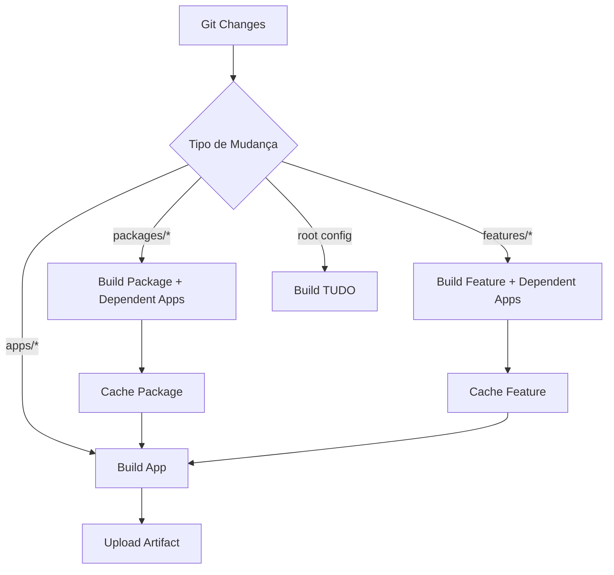

# CI/CD Guide - easy-nup

## Overview

Sistema completo de CI/CD para monorepo easy-nup com **affected detection**, **builds condicionais**, e **deployment automatizado** para arquitetura Multi-Repl.

## Quick Start

### 1. Local Development

```bash
# Desenvolvimento normal
pnpm dev

# Build específico
cd apps/nup-study && pnpm run build

# Criar deployment bundle
./scripts/deploy-nup-study.sh
```

### 2. Continuous Integration (Automático)

```bash
# Ao fazer push ou PR para main/develop:
git push origin feature-branch
```

GitHub Actions automaticamente:
1. ✅ Detecta workspaces afetados
2. ✅ Builda apenas o necessário (affected)
3. ✅ Valida estrutura dos apps
4. ✅ Gera summary no PR

### 3. Deployment (Manual)

```bash
# Via GitHub UI:
Actions → CD - Deploy to Production → Run workflow
```

Escolha:
- **App:** nup-study | nup-identify | nup-aim
- **Environment:** staging | production

Resultado:
- Bundle comprimido: `{app}-{sha}.tar.gz`
- Pronto para deploy em target Repl

---

## Architecture

### Affected Detection System



### Dependency Tracking Matrix

O sistema detecta automaticamente quais apps dependem de cada package/feature:

| Package/Feature | Dependent Apps | Notes |
|----------------|----------------|-------|
| @nup/ui | nup-study | UI components |
| @nup/shared-types | nup-study | Shared TypeScript types |
| @nup/api-client | nup-study | TanStack Query client |
| @nup/auth-client | nup-study | Replit Auth integration |
| @nup/email | nup-identify | Email service |
| @nup/flashcards | nup-study | Flashcards feature |
| @nup/mindmaps | nup-study | Mind maps feature |
| @nup/professor-ia | nup-study | AI tutor feature |

**Como funciona:**
1. Detecta mudanças em packages/features
2. Escaneia `apps/*/package.json` procurando por `"@nup/{package}"`
3. Adiciona apps dependentes ao output JSON
4. Workflow builda apps diretos + dependentes

**Exemplo:**
```bash
# Mudança em packages/@nup/ui/src/button.tsx

detect-affected.sh output:
{
  "packages": ["ui"],
  "apps": ["nup-study"]  ← Dependente detectado!
}

Result: nup-study é buildado para detectar regressões
```

**Exemplo 1:** Mudança em `packages/@nup/ui`
```
Changed: packages/@nup/ui/src/button.tsx
→ Build: @nup/ui
→ Build: @nup/flashcards (depende de ui)
→ Build: nup-study (depende de ui)
→ Skip: nup-identify (não depende de ui)
```

**Exemplo 2:** Mudança em `apps/nup-study` apenas
```
Changed: apps/nup-study/client/src/pages/Home.tsx
→ Build: nup-study apenas
→ Skip: packages/* (não mudaram)
→ Skip: features/* (não mudaram)
→ Skip: outros apps
```

---

## Workflows Detalhados

### CI Build Workflow

**Arquivo:** `.github/workflows/ci-build.yml`

**Trigger:**
- Push para `main` ou `develop`
- Pull Request para `main` ou `develop`

**Jobs:**

```yaml
detect-changes → build-packages → build-features → build-apps → validation → summary
                     ↓                    ↓                ↓
                   cache              cache          artifacts
```

**1. detect-changes**
- Compara commits: `git diff BASE..HEAD`
- Output: JSON com workspaces afetados
- Exemplo output:
  ```json
  {
    "apps": ["nup-study"],
    "packages": ["ui", "shared-types"],
    "features": ["flashcards"]
  }
  ```

**2. build-packages**
- Conditional: `if packages != []`
- Executa: `pnpm -r --filter "./packages/@nup/*" run build`
- Cache key: `packages-{github.sha}`
- Cache path: `packages/@nup/*/dist`

**3. build-features**
- Conditional: `if features != [] OR packages != []`
- Restaura: cache de packages
- Executa: `pnpm -r --filter "./features/@nup/*" run build`
- Cache key: `features-{github.sha}`

**4. build-apps (Matrix)**
- Matrix: um job por app afetado
- Restaura: cache de packages + features
- Executa: `pnpm run build` em `apps/{app}`
- Upload: `dist/` como artifact

**5. validation**
- Executa: `./scripts/validate-app.sh {app}`
- Verifica: `dist/index.js` existe
- Confirma: estrutura correta

**6. summary**
- Gera: markdown summary no GitHub
- Mostra: workspaces afetados + status dos jobs
- Sempre executa (mesmo se jobs falharem)

---

### CD Deploy Workflow

**Arquivo:** `.github/workflows/cd-deploy.yml`

**Trigger:** Manual (workflow_dispatch)

**Inputs:**
- `app`: qual app deployar
- `environment`: staging | production

**Job: create-bundle**

```bash
# 1. Criar bundle
./scripts/deploy-{app}.sh ./ci-output

# 2. Verificar integridade
- CHECKSUMS.txt existe?
- dist/index.js existe?
- node_modules populado?

# 3. Smoke tests
./scripts/smoke-test.sh ./ci-output/{app}

# 4. Comprimir
tar -czf {app}-{sha}.tar.gz {app}

# 5. Upload artifact
# Retention: 30 dias
```

**Output:**
- Artifact: `{app}-bundle-{sha}`
- Summary: estatísticas + próximos passos

---

## Scripts de CI/CD

### 1. `scripts/detect-affected.sh`

Detecta workspaces afetados por mudanças git.

**Sintaxe:**
```bash
./scripts/detect-affected.sh [base-ref] [head-ref]
```

**Exemplos:**
```bash
# Comparar último commit
./scripts/detect-affected.sh HEAD^ HEAD

# Comparar branches
./scripts/detect-affected.sh main develop

# Comparar PR
./scripts/detect-affected.sh origin/main HEAD
```

**Output:**
```json
{
  "apps": ["nup-study", "nup-aim"],
  "packages": ["ui"],
  "features": []
}
```

**Regras Especiais:**

| Mudança | Comportamento |
|---------|--------------|
| `apps/{app}/*` | Apenas esse app |
| `packages/@nup/{pkg}/*` | Package + apps que dependem dele |
| `features/@nup/{feat}/*` | Feature + apps que dependem dela |
| `package.json` (root) | **TUDO** |
| `pnpm-workspace.yaml` | **TUDO** |
| `turbo.json` | **TUDO** |

---

### 2. `scripts/smoke-test.sh`

Valida bundles de deployment.

**Sintaxe:**
```bash
./scripts/smoke-test.sh <bundle-path>
```

**Exemplo:**
```bash
./scripts/smoke-test.sh ./deploy-output/nup-study
```

**Tests Executados:**

1. **Critical Files**
   - ✅ `package.json` existe
   - ✅ `dist/index.js` existe
   - ✅ `node_modules/` existe

2. **Valid JSON**
   - ✅ `package.json` é JSON válido

3. **Workspace Dependencies**
   - ✅ Nenhum `workspace:*` permanece
   - ✅ Todas deps resolvidas para `file:`

4. **Server Bundle**
   - ✅ `dist/index.js` pode ser carregado
   - ✅ Sem erros sintáticos/import

5. **Checksums**
   - ✅ `CHECKSUMS.txt` existe (opcional)

6. **Bundle Size**
   - ✅ Entre 50MB - 1GB (razoável)

**Output Success:**
```
✅ All smoke tests passed!

📊 Bundle Summary:
  Location: ./deploy-output/nup-study
  Size: 250MB
  Files: 12500
  Packages: 88
```

---

## Deployment Manual

### Opção A: Via GitHub Actions (Recomendado)

```bash
# 1. Trigger workflow
GitHub UI → Actions → CD Deploy → Run workflow
  App: nup-study
  Environment: production

# 2. Aguardar conclusão (~10min)

# 3. Download artifact
Actions → Workflow run → Artifacts → Download

# 4. Extract
tar -xzf nup-study-abc123.tar.gz

# 5. Upload para Repl
rsync -avz nup-study/ user@target-repl:/app/

# 6. Configure env vars no Repl
DATABASE_URL=...
JWT_SECRET=...
OPENAI_API_KEY=...

# 7. Start
ssh user@target-repl
cd /app
node dist/index.js
```

### Opção B: Local Deploy Script

```bash
# 1. Criar bundle local
./scripts/deploy-nup-study.sh ./my-deploy

# 2. Smoke test
./scripts/smoke-test.sh ./my-deploy/nup-study

# 3. Upload manual
cd my-deploy
tar -czf bundle.tar.gz nup-study
scp bundle.tar.gz user@target-repl:/tmp/

# 4. Extract no Repl
ssh user@target-repl
cd /app
tar -xzf /tmp/bundle.tar.gz
node dist/index.js
```

---

## Best Practices

### 1. Sempre Testar Localmente Primeiro

```bash
# Build local
cd apps/nup-study && pnpm run build

# Deploy local
./scripts/deploy-nup-study.sh ./test

# Smoke test
./scripts/smoke-test.sh ./test/nup-study

# Test runtime
cd test/nup-study
node dist/index.js
```

### 2. Usar PR para Validação

```bash
# Criar PR
git checkout -b feature/new-ui
# ... make changes
git push origin feature/new-ui

# GitHub Actions automaticamente:
# - Detecta affected workspaces
# - Builda apenas o necessário
# - Valida estrutura
# - Mostra summary no PR
```

### 3. Deploy Incremental

```bash
# Sempre deployar para staging primeiro
Actions → CD Deploy
  App: nup-study
  Environment: staging

# Testar em staging
curl https://staging-nup-study.replit.app/health

# Só depois deployar para production
Actions → CD Deploy
  App: nup-study
  Environment: production
```

### 4. Rollback Strategy

```bash
# Manter últimos 5 bundles
# GitHub artifacts retention: 30 dias

# Para rollback:
# 1. Download artifact antigo
# 2. Extract
# 3. Deploy versão anterior
# 4. Verify health checks
```

---

## Troubleshooting

### CI Build Falha

**Sintoma:** Build packages falha com erro TypeScript

**Causa:** Mudança em shared-types quebrou package

**Solução:**
```bash
# Local
pnpm -r --filter "./packages/@nup/*" run build

# Fix erros TypeScript
# Push fix

# CI rebuilda automaticamente
```

---

### Deployment Bundle Inválido

**Sintoma:** Smoke test falha com "workspace:* not found"

**Causa:** Deploy script não resolveu workspace deps

**Solução:**
```bash
# Verificar deploy-app.sh
# Step 5/6 deve resolver workspace deps

# Testar local
./scripts/deploy-nup-study.sh ./debug
cat ./debug/nup-study/package.json | grep workspace
# Não deve mostrar nada

# Se mostra workspace:*, deploy-app.sh tem bug
```

---

### Cache Corrompido

**Sintoma:** Build sucede no CI mas app não roda

**Causa:** Cache antigo com build quebrado

**Solução:**
```yaml
# Limpar cache manualmente
gh cache delete packages-{sha}
gh cache delete features-{sha}

# Ou: Re-run workflow com cache limpo
```

---

## Performance Metrics

### Build Times (Affected vs Full)

| Scenario | Affected | Full Build | Economia |
|----------|----------|-----------|----------|
| 1 package mudado | 2min | 8min | **75%** |
| 1 feature mudado | 3min | 9min | **67%** |
| 1 app mudado | 3min | 10min | **70%** |
| Root config mudado | 10min | 10min | 0% |
| Typical PR | 2-4min | 10min | **60-80%** |

### Cache Hit Rates

- **Packages:** 90% (rebuilda só quando muda)
- **Features:** 85% (rebuilda quando package muda)
- **Apps:** 70% (rebuilda quando package/feature muda)

### Deployment

- **Bundle Creation:** 8-12min
- **Smoke Tests:** 10-30s
- **Compression:** 30-60s
- **Total:** ~10-15min por app

---

## Security

### Secrets Management

**GitHub Actions Secrets:**
```yaml
# Necessários para deploy automático (future):
REPLIT_API_TOKEN
DATABASE_URL_PRODUCTION
JWT_SECRET_PRODUCTION
```

**Nunca commitar:**
- `.env` files
- API keys
- Database URLs
- JWT secrets

**Bundle Security:**
- Bundles NÃO incluem secrets
- Secrets são configurados no target Repl
- Checksums SHA256 para verificar integridade

---

## Future Enhancements

### Phase 4 (Roadmap)

- [ ] Automatic deployment via Replit API
- [ ] Integration tests em bundles
- [ ] Performance benchmarks
- [ ] Health check monitoring
- [ ] Automated rollback
- [ ] Multi-region deployment
- [ ] Blue-green deployments
- [ ] Canary releases
- [ ] Deployment notifications (Slack/Discord)

---

## Support

**Documentação:**
- `scripts/README.md` - Deploy scripts
- `.github/workflows/README.md` - Workflows
- `docs/DEPLOYMENT_GUIDE.md` - Multi-Repl deployment

**Scripts:**
- `scripts/deploy-app.sh` - Base deploy script
- `scripts/validate-app.sh` - Validation
- `scripts/detect-affected.sh` - Affected detection
- `scripts/smoke-test.sh` - Smoke tests

**Workflows:**
- `.github/workflows/ci-build.yml` - CI
- `.github/workflows/cd-deploy.yml` - CD
